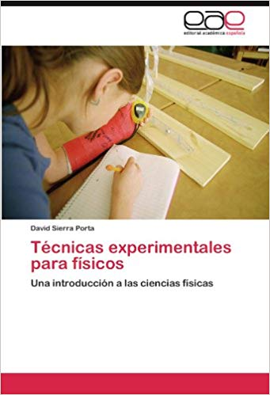

_Bienvenidos a mi página personal. Para mí, lo más importante es poder aprender cosas todos los días y progresar. Realmente disfruto mi trabajo. Otro aspecto del trabajo que realmente me gusta es la necesidad de explicar nuestro trabajo en términos simples a los no expertos. Me encanta abordar problemas complicados y tratar de encontrar soluciones originales para abordarlos. Y no hay nada rutinario al respecto, aprendemos cosas nuevas todo el tiempo y los problemas en los que trabajamos son muy variados._

- Lic. en Matemáticas y Física (LUZ-VE). M.Sc. en Física Fundamental (ULA-VE). Doctor en Física Fundamental (ULA-VE).
- Posición actual: Investigador Posdoctoral y Profesor en Universidad de los Andes. Bogotá-Colombia.
- Áreas de Interés: Física de altas energías, Gravitación y Cosmología, Rayos cósmicos, Clima espacial.

<h1>Notas de Clases</h1>

<h2>Electromagnetismo</h2>
1. Carga eléctrica y distribuciones de carga. [[cargaelectrica.pdf](electromagnetismo/cargaelectrica.pdf)]
2. Cálculos de campo eléctrico en distribuciones continuas de carga. [[campo_electrico_DC.pdf](electromagnetismo/campo_electrico_DC.pdf)]
3. Ley de Gauss. [[leyGauss.pdf](electromagnetismo/leyGauss.pdf)]

<h2>Oscilaciones y Ondas</h2>
1. Oscilaciones I: Movimiento Armónico Simple. [[oscilaciones1.pdf](ondas/oscilaciones1.pdf)]
2. Oscilaciones II: Péndulo simple. [[oscilaciones2.pdf](ondas/oscilaciones2.pdf)]
3. Oscilaciones III: Oscilaciones Amortiguadas. [[oscilaciones3.pdf](ondas/oscilaciones3.pdf)]
4. Oscilaciones IV: Oscilaciones Forzadas y Resonancia. [[oscilaciones4.pdf](ondas/oscilaciones4.pdf)]
  - Algunos ejercicios resueltos. [[ejercicios_MAS.pdf](ondas/ejerciciosMAS.pdf)]
5. Ondas I: Introducción a las ondas. [[ondas1.pdf](ondas/ondas1.pdf)]
6. Ondas II: Ondas transversales. [[ondas2.pdf](ondas/ondas2.pdf)]
7. Ondas III: Reflexión, transmisión y energía en ondas transversales. [[ondas3.pdf](ondas/ondas3.pdf)]
8. Ondas IV: Ondas longitudinales. [[ondas4.pdf](ondas/ondas4.pdf)]
9. Ondas Electromagnéticas I: Ondas Electromagnéticas. [[ondasEM1.pdf](ondas/ondasEM1.pdf)]

<h2>Proyecto: Clima espacial y Rayos Cósmicos</h2>

La variación de 11 años en la intensidad de los rayos cósmicos galácticos (GCR) generalmente se asocia con una variación similar de la actividad solar (SA); existe una anticorrelación entre ellos. En una serie de trabajos clásicos que datan de 1954, Forbush estableció la existencia de una anti-correlación cíclica de 11 años entre la intensidad de rayos cósmicos galácticos y la actividad solar, medida por el número de manchas solares. En el presente documento se exponen los objetivos y metodología para la consolidación de un proyecto encaminado al estudio de las relaciones entre Intensidad de Rayos Cósmicos Galácticos y Actividad Solar desde distintos tipos de vista.

- **Proyecto y Resultados Preliminares:** [Resultados_Preliminares_Proy_RC_AS.pdf (Octubre19)](rayos_cosmicos/Resultados_Preliminares_Proy_RC_AS.pdf)
- **Nuevos resultados:** [Resultados_Proy_RC_AS.pdf (Noviembre19)]

  
<h2>Mi libro: tecnicas experimentales para fisicos</h2>
{:style="float: left;margin-right: 7px;margin-top: 7px;":height="20%" width="20%"}

Este libro trata de algunas primeras nociones absolutamente indispensables con las que deben encontrarse los estudiantes en el inicio de la carrera de la licenciatura en ciencias físicas, herramientas definitivamente necesarias para la continuación de las asignaturas en curso y venideras, pero que, por estar incluídos en tratados de matemáticas o ciencias (por separado), no son tratados de manera formal; o también porque son considerados aburridos o fastidiosos. Los problemas concernientes a las definiciones de unidades, medidas, dimensiones y errores pudieron haber sido tratados en el bachillerato pero seguramente de una manera muy rápida y casi con toda seguridad con matemáticas y lógicas incompletas, debido fundamentalmente a la falta de base para tratarlas. Seguro será de mucha ayuda para todos como material de referencia o como lectura complementaria para introducirse y profundizar en las nociones de las técnicas experimentales en la resolución de problemas de ciencias.
