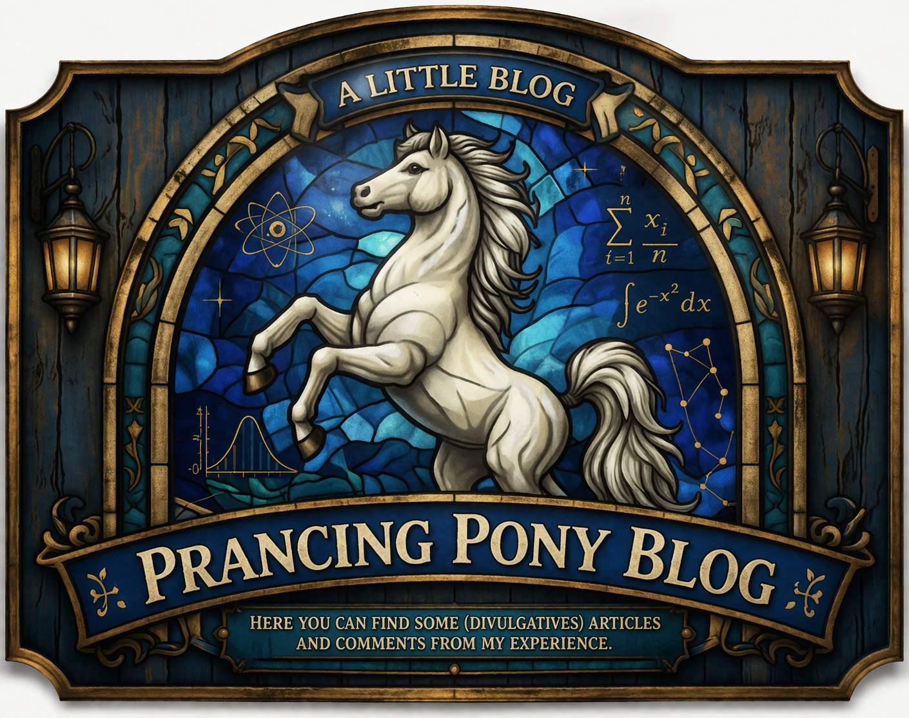

__Welcome to my personal page__. For me, the most important thing is to be able to learn things every day and to progress. I really enjoy my work. Another aspect of the job that I really like is the need to explain our work in simple terms to non-experts. I love tackling complicated problems and trying to find original solutions to address them. And there is nothing routine about it, we learn new things all the time and the problems we work on are very varied.

I am David Sierra-Porta, a researcher at the intersection of astrophysics, environmental science, and data science. I study complex systems—cosmic rays, solar activity, and air-quality dynamics—using machine learning, statistical modeling, and multifractal methods. My work combines physics, statistics, and environmental analytics to build interpretable models and practical tools, from space-weather forecasting to environmental monitoring. I collaborate widely and translate research into solutions with societal value. I am committed to mentoring students and communicating science clearly to broader audiences. Through this work I aim to advance understanding, foster innovation, and support evidence-based decisions. In addition to my research activities, I am actively involved in mentoring and teaching, helping to train the next generation of scientists. My commitment to science extends to public engagement, where I strive to make complex scientific concepts accessible to a broader audience. Through my work, I aim to advance knowledge, foster innovation, and contribute to the scientific community's efforts to address global challenges.

## **Background:**
- Mathematics and Physics (LUZ-VE). Fundamental Physics, MsC. (ULA-VE). Fundamental Physics, PhD. (ULA-VE).
- __Current Position:__ Full Time Research and Professor [Universidad Tecnológica de Bolivar](https://www.utb.edu.co/). Digital Transformation Faculty and Basics Science Faculty. Cartagena de Indias - Colombia.
- __Interest:__ Astrophysics, Gravitation and Cosmology, Cosmics Rays, Space Weather, Data Science, Environmental Physics.

  <a class="btn" href="/Files/cvdavid_resumen_es.pdf">My resume (in spanish)</a>
  <a class="btn" href="/Files/cvdavid_resumen_en.pdf">My resume (in english)</a>
  <a class="btn" href="https://scienti.minciencias.gov.co/cvlac/visualizador/generarCurriculoCv.do?cod_rh=0000125474">CVLac profile</a>
  <a class="btn" href="https://scholar.google.com.co/citations?hl=en&user=-OInFfYAAAAJ&view_op=list_works&sortby=pubdate">GoogleScholar profile</a>
  <a class="btn" href="https://github.com/sierraporta">Github profile (sierraporta)</a>
  <a class="btn" href="https://orcid.org/0000-0003-3461-1347">Orcid profile (D. Sierra-Porta, 0000-0003-3461-1347)</a>
  <a class="btn" href="https://www.scopus.com/authid/detail.uri?authorId=57191333650">Scopus profile (D. Sierra-Porta, 57191333650)</a>
  <a class="btn" href="mailto:sierraporta@gmail.com">Contact me</a>

## **Research Profile**

<!-- START_SECTION:research-profile -->
<!-- END_SECTION:research-profile -->

## **A little blog: *Prancing Pony blog***

- _Here you can find some (divulgatives) articles and comments from my experience._
- This blog is a space dedicated to sharing my experiences and reflections in the fields of data science, physics, mathematics, and other related areas. Through stories, commentary, and analysis, I will explore complex concepts, recent discoveries, practical applications, and personal challenges I have encountered throughout my professional and academic journey. My goal is to inspire other science and technology enthusiasts, share useful knowledge, and foster collaborative learning in such exciting subjects as statistics, mathematical modeling, and data analysis. Welcome, and I hope you enjoy the journey!
- Go there: [https://sierraporta.github.io/prancing-pony/](https://sierraporta.github.io/prancing-pony/)

## **Lecture Notes**
In this section you will find some lecture notes that I have accumulated over time for various courses and topics and that I have used in my own courses. By now they are always in constant modification and updating and represent (I think) a good starting point to start and then deepen in each of the topics. Visit, read and share (if you think they are good) these lecture notes in the following links:

| Lectures | Description | Link | Updated |
| --- | --- | --- | --- |
| **Introducción a la Ciencia de Datos** | Introducción a la Ciencia de Datos es un curso práctico que enseña a transformar datos en evidencia para tomar decisiones: desde la formulación de preguntas, la recolección y limpieza, hasta el análisis y la visualización. El estudiante aprende a programar flujos reproducibles (principalmente en Python/Jupyter), construir baselines y evaluar resultados con criterio. Al final, desarrolla un proyecto aplicado comunicando hallazgos con claridad, contexto y ética. | [Notes](./introCDAT.md) | Feb. 2026 |
| **Programación para Ciencia de Datos** | Programación para Ciencia de Datos es un curso práctico donde el estudiante aprende a escribir código limpio y reproducible para cargar, transformar y analizar datos. Se trabajan estructuras básicas, funciones, control de flujo y manejo de archivos, junto con el uso de librerías clave (p. ej., NumPy/Pandas) en Jupyter. El cierre del curso es un mini-proyecto donde se automatiza un pipeline de datos y se reportan resultados con visualizaciones claras. | [Notes](./programacionCDAT.md) | Aug. 2025 |
| **Sensado y Modelado de Sistemas Físicos** | Sensado y Modelado de Sistemas Físicos es un curso aplicado donde el estudiante aprende a adquirir datos desde sensores (experimentales o remotos), depurarlos y convertirlos en variables físicas interpretables. Se construyen modelos matemáticos y computacionales para describir y predecir el comportamiento de sistemas reales, validándolos contra mediciones. El énfasis está en reproducibilidad (Python/Jupyter), incertidumbre, y en comunicar resultados con criterio científico. | [Notes](./sensado.md) | Aug. 2025 |
| **Machine Learning** | Machine Learning es un curso riguroso y práctico donde el estudiante aprende a construir modelos que generalizan a datos nuevos, entendiendo el flujo completo: problema, datos, preprocesamiento, entrenamiento y evaluación honesta. Se implementan métodos supervisados y no supervisados con énfasis en validación, métricas, control de sobreajuste y reproducibilidad en Python/Jupyter. El curso culmina en un proyecto aplicado con reporte y presentación defendiendo decisiones metodológicas, sesgos y limitaciones. | [Notes](./machinelearning.md) | Jan. 2026 |
| **Storytelling y Narrativa de Datos** | Storytelling y Narrativa de Datos es un curso práctico donde el estudiante aprende a convertir análisis en historias claras y accionables para audiencias específicas. Se trabajan principios de visualización, diseño y estructura narrativa, construyendo entregables reproducibles en Python/Jupyter (y, cuando aplica, dashboards). El cierre es un proyecto final con presentación pública, defendiendo decisiones visuales, transparencia, sesgos y límites de los datos. | [Notes](./storytelling.md) | Jan. 2026 |
| **Electricidad y Magnetismo** | Electricidad y Magnetismo es un curso fundamental donde el estudiante construye una base sólida para entender campos eléctricos y magnéticos, potencial, circuitos y fenómenos de inducción. Se combinan demostraciones y resolución de problemas con una mirada física rigurosa, conectando los modelos teóricos con mediciones y aplicaciones reales. El curso enfatiza razonamiento matemático, representación vectorial y pensamiento experimental para interpretar el electromagnetismo en sistemas cotidianos y tecnológicos. | [Notes](./notas_de_clase_Electromagnetismo.md) | July 2025 |
| **Oscilaciones y Ondas** | Oscilaciones y Ondas es un curso donde el estudiante comprende cómo surgen el comportamiento oscilatorio y la propagación de ondas en sistemas físicos, desde resortes y péndulos hasta ondas mecánicas y acústicas. Se trabajan modelos diferenciales, resonancia, amortiguamiento, superposición e interferencia, conectando teoría con experimentos y simulaciones. El énfasis está en interpretar parámetros físicos, validar modelos con datos y comunicar resultados con claridad. | [Notes](./notas_de_clase_Ondas.md) | Aug. 2023 |
| Curso de Introducción a la Estadística y Ciencia de datos. (**En construcción!**) | | [Github](https://github.com/sierraporta/Data_Science_Introduction), [Version Web](https://sierraporta.github.io/Data_Science_Introduction/) | --- |

