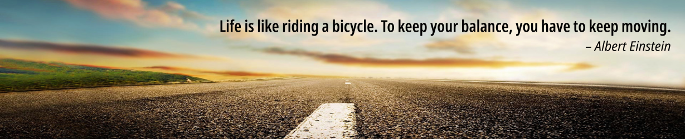
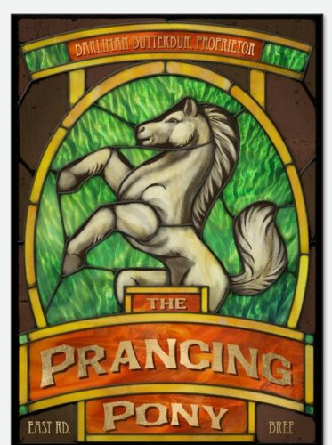

__Welcome to my personal page__. For me, the most important thing is to be able to learn things every day and to progress. I really enjoy my work. Another aspect of the job that I really like is the need to explain our work in simple terms to non-experts. I love tackling complicated problems and trying to find original solutions to address them. And there is nothing routine about it, we learn new things all the time and the problems we work on are very varied.

I am David Sierra-Porta, a researcher at the intersection of astrophysics, environmental science, and data science. I study complex systems—cosmic rays, solar activity, and air-quality dynamics—using machine learning, statistical modeling, and multifractal methods. My work combines physics, statistics, and environmental analytics to build interpretable models and practical tools, from space-weather forecasting to environmental monitoring. I collaborate widely and translate research into solutions with societal value. I am committed to mentoring students and communicating science clearly to broader audiences. Through this work I aim to advance understanding, foster innovation, and support evidence-based decisions. In addition to my research activities, I am actively involved in mentoring and teaching, helping to train the next generation of scientists. My commitment to science extends to public engagement, where I strive to make complex scientific concepts accessible to a broader audience. Through my work, I aim to advance knowledge, foster innovation, and contribute to the scientific community's efforts to address global challenges.

## Background:
- Mathematics and Physics (LUZ-VE). Fundamental Physics, MsC. (ULA-VE). Fundamental Physics, PhD. (ULA-VE).
- __Current Position:__ Full Time Research and Professor [Universidad Tecnológica de Bolivar](https://www.utb.edu.co/). Digital Transformation Faculty and Basics Science Faculty. Cartagena de Indias - Colombia.
- __Interest:__ Astrophysics, Gravitation and Cosmology, Cosmics Rays, Space Weather, Data Science, Environmental Physics.
- __GoogleScholar profile:__ [Scholar Google (D.Sierra-Porta)](https://scholar.google.com.co/citations?hl=en&user=-OInFfYAAAAJ&view_op=list_works&sortby=pubdate)
- __CVLac profile:__ [CVLac (D.Sierra-Porta)](https://scienti.minciencias.gov.co/cvlac/visualizador/generarCurriculoCv.do?cod_rh=0000125474)
- __ORCID profile:__ [(D.Sierra-Porta, 0000-0003-3461-1347)](https://orcid.org/0000-0003-3461-1347)
- __Scopus profile:__ [(D.Sierra-Porta) - 57191333650](https://www.scopus.com/authid/detail.uri?authorId=57191333650)
- __Github profile:__ [(sierraporta)](https://github.com/sierraporta)
- __My resume (in spanish):__ [Resume - cvitae (D.Sierra-Porta)](Files/cvdavid_resumen_es.pdf) [Updated september 2024]
- __My resume (in english):__ [Resume - cvitae (D.Sierra-Porta)](Files/cvdavid_resumen_en.pdf) [Updated september 2024]

# A little blog: **Prancing Pony blog**

- _Here you can find some (divulgatives) articles and comments from my experience._
- This blog is a space dedicated to sharing my experiences and reflections in the fields of data science, physics, mathematics, and other related areas. Through stories, commentary, and analysis, I will explore complex concepts, recent discoveries, practical applications, and personal challenges I have encountered throughout my professional and academic journey. My goal is to inspire other science and technology enthusiasts, share useful knowledge, and foster collaborative learning in such exciting subjects as statistics, mathematical modeling, and data analysis. Welcome, and I hope you enjoy the journey!
- Go there: [https://sierraporta.github.io/prancing-pony/](https://sierraporta.github.io/prancing-pony/)

# Lecture Notes
In this section you will find some lecture notes that I have accumulated over time for various courses and topics and that I have used in my own courses. By now they are always in constant modification and updating and represent (I think) a good starting point to start and then deepen in each of the topics. Visit, read and share (if you think they are good) these lecture notes in the following links:

| Lectures | Link | Updated |
| --- | --- | --- |
| Introducción a la Ciencia de datos | [Notes](./introCDAT.md) | Aug. 2025 |
| Programación para Ciencia de datos | [Notes](./programacionCDAT.md) | Aug. 2025 |
| Sensado y Modelado de Sistemas Físicos | [Notes](./sensado.md) | Aug. 2025 |
| Electricity and magnetism course | [Notes](./notas_de_clase_Electromagnetismo.md) | July 2025 |
| Oscilations and waves course | [Notes](./notas_de_clase_Ondas.md) | Aug. 2023 |
| Curso de Introducción a la estadística y Ciencia de datos: | [Github](https://github.com/sierraporta/Data_Science_Introduction), [Version Web](https://sierraporta.github.io/Data_Science_Introduction/) | --- |

## My Book: tecnicas experimentales para fisicos

This book deals with some absolutely indispensable first notions with which students must encounter at the beginning of the bachelor's degree course in physical sciences, tools definitely necessary for the continuation of ongoing and upcoming subjects, but which, because they are included in mathematics or science treatises (separately), are not treated in a formal way; or also because they are considered boring or tiresome. Problems concerning definitions of units, measures, dimensions and errors could have been dealt with in high school but certainly in a very fast way and almost certainly with incomplete mathematics and logic, mainly due to the lack of a basis for dealing with them. It will surely be of much help to all as reference material or as complementary reading to introduce and deepen the notions of experimental techniques in the resolution of science problems.
