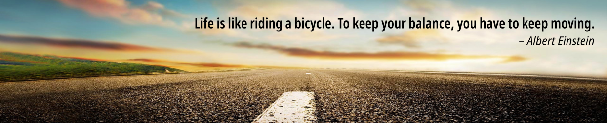
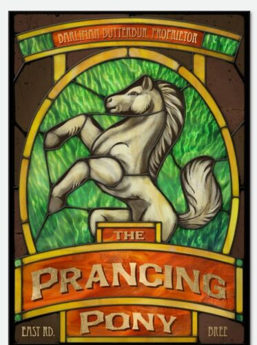

__Welcome to my personal page__. For me, the most important thing is to be able to learn things every day and to progress. I really enjoy my work. Another aspect of the job that I really like is the need to explain our work in simple terms to non-experts. I love tackling complicated problems and trying to find original solutions to address them. And there is nothing routine about it, we learn new things all the time and the problems we work on are very varied.

> I am Dr. David Sierra-Porta, a dedicated researcher in astrophysics, environmental science, and data analysis. My research focuses on applying advanced methodologies such as machine learning and multifractal analysis to unravel complex phenomena, including cosmic rays, solar activity, and air quality dynamics. I have published extensively in prestigious journals, contributing to our understanding of these areas. My work is characterized by an interdisciplinary approach, combining insights from physics, statistics, and environmental science. I collaborate with experts across fields to address pressing scientific questions and develop innovative solutions to real-world challenges. I am passionate about bridging the gap between scientific research and practical applications, aiming to improve technologies related to space weather forecasting and environmental monitoring. In addition to my research activities, I am actively involved in mentoring and teaching, helping to train the next generation of scientists. My commitment to science extends to public engagement, where I strive to make complex scientific concepts accessible to a broader audience. Through my work, I aim to advance knowledge, foster innovation, and contribute to the scientific community's efforts to address global challenges.

- Mathematics and Physics (LUZ-VE). Fundamental Physics, MsC. (ULA-VE). Fundamental Physics, PhD. (ULA-VE).
- __Current Position:__ Full Time Research and Professor [Universidad Tecnológica de Bolivar](https://www.utb.edu.co/). Basics Science Faculty. Cartagena de Indias - Colombia.
- __Interest:__ Astrophysics, Gravitation and Cosmology, Cosmics Rays, Space Weather, Data Science, Environmental Physics.
- __GoogleScholar profile:__ [Scholar Google (D.Sierra-Porta)](https://scholar.google.com.co/citations?hl=en&user=-OInFfYAAAAJ&view_op=list_works&sortby=pubdate)
- __CVLac profile:__ [CVLac (D.Sierra-Porta)](https://scienti.minciencias.gov.co/cvlac/visualizador/generarCurriculoCv.do?cod_rh=0000125474)
- __Scopus profile:__ [(D.Sierra-Porta) - 57191333650](https://www.scopus.com/authid/detail.uri?authorId=57191333650)
- __Github profile:__ [(sierraporta)](https://github.com/sierraporta)
- __My resume (in spanish):__ [Resume - cvitae (D.Sierra-Porta)](Files/cvdavid_resumen_es.pdf) [Updated september 2024]
- __My resume (in english):__ [Resume - cvitae (D.Sierra-Porta)](Files/cvdavid_resumen_en.pdf) [Updated september 2024]

# A little blog

Here you can find some (divulgatives) articles and comments from my experience. Go there: [Go to Prancing Pony blog entries...](https://sierraporta.github.io/prancing-pony.github.io/)

# Lecture Notes
In this section you will find some lecture notes that I have accumulated over time for various courses and topics and that I have used in my own courses. By now they are always in constant modification and updating and represent (I think) a good starting point to start and then deepen in each of the topics. Visit, read and share (if you think they are good) these lecture notes in the following links:

| Lectures | Link 1 | Link 2 |
| --- | --- | --- |
| Notas de Clase de Electromagnetismo | [Notas](./notas_de_clase_Electromagnetismo.md) |  |
| Notas de Clase de Oscilaciones y Ondas | [Notas](./notas_de_clase_Ondas.md) |  |
| Curso de Modelado matemático: | [Github](https://github.com/sierraporta/ModeladoMatematico) |  |
| Curso de Introducción a la estadística y Ciencia de datos: | [Github](https://github.com/sierraporta/Data_Science_Introduction) | [Version Web](https://sierraporta.github.io/Data_Science_Introduction/) |

## My Book: tecnicas experimentales para fisicos

This book deals with some absolutely indispensable first notions with which students must encounter at the beginning of the bachelor's degree course in physical sciences, tools definitely necessary for the continuation of ongoing and upcoming subjects, but which, because they are included in mathematics or science treatises (separately), are not treated in a formal way; or also because they are considered boring or tiresome. Problems concerning definitions of units, measures, dimensions and errors could have been dealt with in high school but certainly in a very fast way and almost certainly with incomplete mathematics and logic, mainly due to the lack of a basis for dealing with them. It will surely be of much help to all as reference material or as complementary reading to introduce and deepen the notions of experimental techniques in the resolution of science problems.
